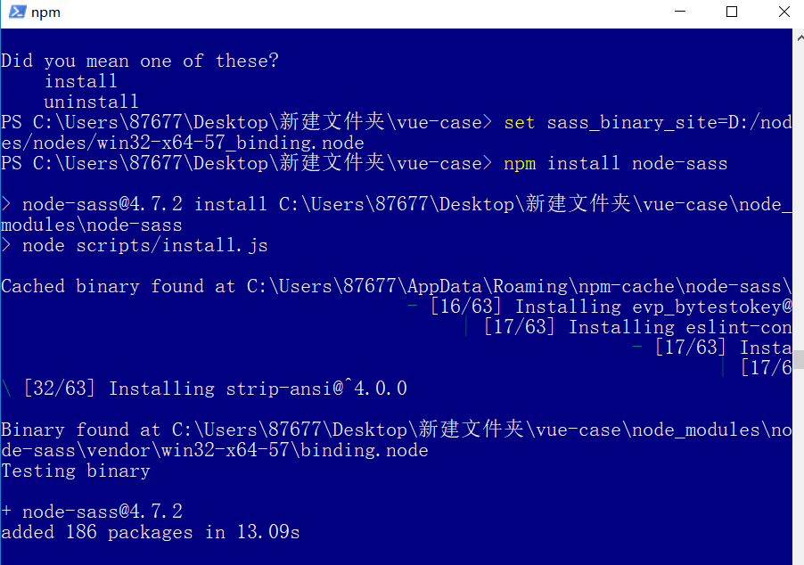
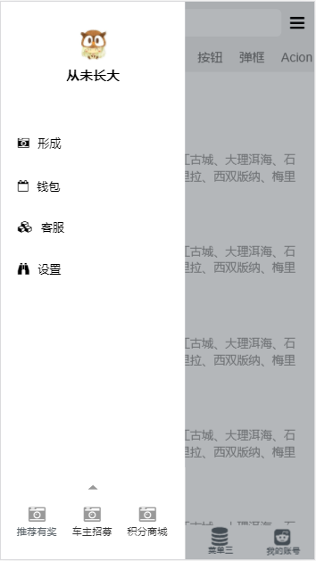
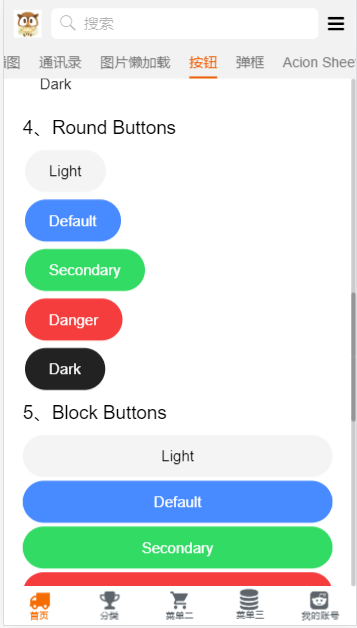

# vue-case

> A Vue.js project

## 项目构建启动

由于node-sass安装过程中总会遇到N多坑，为了避免安装失败，（可参照 https://www.v2ex.com/t/361746  https://www.jianshu.com/p/145cc862ceec ）
首先检测 python2 命令是否成功，然后执行（请根据自己的node版本下载对应） set sass_binary_site=./node
s/win32-x64-57_binding.node



``` bash

# set sass_binary_site
set sass_binary_site=./node
s/win32-x64-57_binding.node

# install dependencies
npm install

# serve with hot reload at localhost:8080
npm run dev

# build for production with minification
npm run build

# build for production and view the bundle analyzer report
npm run build --report

# run unit tests
npm run unit

# run e2e tests
npm run e2e

# run all tests
npm test
```

# 技术栈
> [vue.js](https://cn.vuejs.org/) 构建用户界面的 MVVM 框架，核心思想是：数据驱动、组件系统。

> [vue-cli](https://www.npmjs.com/package/vue-cli) 是vue的脚手架工具，目录结构、本地调试、代码部署、热加载、单元测试。

> [vue-router](https://router.vuejs.org/zh-cn/) 是官方提供的路由器，使用vue.js构建单页面应用程序变得轻而易举。

> [vue-resource](https://www.npmjs.com/package/vue-resource) 请求数据，服务器通讯。

> [vuex](https://vuex.vuejs.org/zh-cn/) 是一个专为 vue.js 应用程序开发的状态管理模式，简单来说Vuex就是管理数据的。

> [better-scroll](https://github.com/ustbhuangyi/better-scroll)  是一款重点解决移动端（未来可能会考虑 PC 端）各种滚动场景需求的插件。

> [vue-lazyload](https://github.com/hilongjw/vue-lazyload)  是一款实现图片懒加载的插件。

## 效果展示






